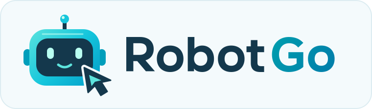

# Robotgo

<p align="center">
  
</p>

[](https://github.com/go-vgo/robotgo/commits/master)
[](https://circleci.com/gh/go-vgo/robotgo)
[](https://codecov.io/gh/go-vgo/robotgo)
[](https://github.com/go-vgo/robotgo/actions/workflows/lint.yml)
[](https://pkg.go.dev/github.com/go-vgo/robotgo?tab=doc)
[](https://github.com/go-vgo/robotgo/releases/latest)
<a href="https://discord.gg/npPb3NzE4A"></a>

[English](../README.md) | [简体中文](README.zh.md) | [繁體中文](README.zht.md) | 日本語 | [한국어](README.ko.md) | [Français](README.fr.md) | [Deutsch](README.de.md) | [Español](README.es.md) | [Русский](README.ru.md) | [Português](README.pt.md)

> Golang によるデスクトップ自動化、自動テスト、そして AI コンピュータ操作（Computer Use）。<br>
> マウスやキーボードの制御、画面の読み取り、プロセス、ウィンドウハンドル、画像とビットマップ、そしてグローバルイベントの監視を行えます。

RobotGo は Mac、Windows、Linux に対応しており、arm64 および x86-amd64 アーキテクチャをサポートしています。

現在 [Codg](https://github.com/vcaesar/codg) を開発しています。シンプルで使いやすい AI エージェント（Agent）作業システムで、自動化・非同期・並行処理・高効率・高精度を実現します。

<p align="center">
<a href="https://github.com/vcaesar/codg" rel="nofollow">

</a>
</p>

[RobotGo-Pro](https://github.com/vcaesar/robotgo-pro) では、JavaScript、Python、Lua などの他言語版、テクニカルサポート、新機能、そして最新の robotgo バージョン（「現在オープンソース版はありません」）を入手できます。

## 目次

- [ドキュメント](#docs)
- [寄付](#donate)
- [バインディング](#binding)
- [動作環境](#requirements)
- [Cgo 不要ビルド](#cgo-free-builds)
- [インストール](#installation)
- [アップデート](#update)
- [サンプル](#examples)
- [型変換とキー](https://github.com/go-vgo/robotgo/blob/master/docs/keys.md)
- [クロスコンパイル](https://github.com/go-vgo/robotgo/blob/master/docs/install.md#crosscompiling)
- [作者](#authors)
- [計画](#plans)
- [ライセンス](#license)

## Docs

- [GoDoc](https://godoc.org/github.com/go-vgo/robotgo) <br>
- [API ドキュメント](https://github.com/go-vgo/robotgo/blob/master/docs/doc.md)（非推奨、更新されていません）

## Donate

寄付者・スポンサー・その他のお問い合わせ: vzvway@gmail.com

## Binding

[ADB](https://github.com/vcaesar/adb)、Android の adb API をラップしたものです。

## Requirements

**Go 1.26 以降**（[go.mod](../go.mod) を参照）と、いずれかのバックエンド：

- **デフォルト（Cgo）：** `CGO_ENABLED=1`、C コンパイラ、および下記のプラット
  フォームライブラリ。
- **純粋 Go（実験的）：** C ツールチェーン不要。[Cgo 不要ビルド](#cgo-free-builds)
  を参照。

どちらの場合も、使用する機能に応じた[機能別の依存関係](#feature-specific-dependencies)
が必要です。

### Default Cgo setup

#### macOS

Go と Xcode コマンドラインツール（Clang）：

```sh
brew install go
xcode-select --install
```

**権限（Cgo と純粋 Go）：** **システム設定 > プライバシーとセキュリティ** で、
アプリまたはターミナルに**アクセシビリティ**（入力）と**画面収録**（キャプチャ）
を許可してください。

#### Windows

```powershell
winget install GoLang.Go
```

加えて C ツールチェーンを**1 つ**。[LLVM-MinGW](https://github.com/mstorsjo/llvm-mingw)：

```powershell
winget install MartinStorsjo.LLVM-MinGW.UCRT
$env:CC = "clang"
```

または [MinGW-w64 (WinLibs)](https://winlibs.com/)：

```powershell
winget install BrechtSanders.WinLibs.POSIX.UCRT
$env:CC = "gcc"
```

ツールチェーンの `bin`（例：`C:\mingw64\bin`）は `PATH` に含まれ、`GOARCH` と
一致している必要があります。手動でインストールした
[MinGW-w64](https://sourceforge.net/projects/mingw-w64/files) など、Cgo 互換の
他のコンパイラでも動作します。

[Bitmap](https://github.com/vcaesar/bitmap) は MinGW-w64 用の libpng のみを同梱
しています。他のツールチェーンでは libpng を自分でビルドしてください。

#### Linux (X11)

ビルド：GCC、libc ヘッダー、X11/XTest ヘッダー。実行：XTEST を備えた X サーバー
と `DISPLAY` の設定。ネイティブ Wayland は [Cgo 不要ビルド](#cgo-free-builds)
を参照。

**Ubuntu / Debian：**

```sh
# Go（ディストリのパッケージが古すぎる場合は Snap）
sudo snap install go --classic
# または: sudo apt install golang

# コア（Cgo）: コンパイラ、libc、X11、XTest
sudo apt install gcc libc6-dev libx11-dev xorg-dev libxtst-dev

# クリップボード（X11）
sudo apt install xsel xclip

# Bitmap: libpng
sudo apt install libpng++-dev

# GoHook: XCB、XKB
sudo apt install xcb libxcb-xkb-dev x11-xkb-utils libx11-xcb-dev libxkbcommon-x11-dev libxkbcommon-dev
```

**Fedora：**

```sh
# コア（Cgo）: コンパイラ、libc、X11、XTest
sudo dnf install gcc glibc-devel libX11-devel libXtst-devel

# クリップボード（X11）
sudo dnf install xsel xclip

# Bitmap: libpng
sudo dnf install libpng-devel

# GoHook: XKB（Fedora 34 未満: xkbcomp-devel の代わりに xorg-x11-xkb-utils-devel）
sudo dnf install libxkbcommon-devel libxkbcommon-x11-devel xkbcomp-devel
```

### Feature-specific dependencies

コア環境に加えて、使用する機能についてのみ必要です：

- **Linux のクリップボード（Cgo と純粋 Go）：** X11 では `xclip` または `xsel`、
  Wayland では `wl-clipboard`：

  ```sh
  sudo apt install wl-clipboard   # Ubuntu / Debian
  sudo dnf install wl-clipboard   # Fedora
  ```

- **[Bitmap](https://github.com/vcaesar/bitmap)：** libpng ヘッダー。
- **[GoHook](https://github.com/robotn/gohook)：** Linux では XCB/XKB ヘッダー。

Bitmap と GoHook は独立した Cgo パッケージです。純粋 Go の RobotGo バックエンド
でも、それらの C 要件はなくなりません。

## Cgo-free Builds

**実験的な純粋 Go バックエンド**は `CGO_ENABLED=0` でビルドおよびクロスコンパイル
できます（GCC、MinGW、Xcode、X11 ヘッダーは不要）。インポートパスと API は同じで、
バックエンドは**ビルドタグ**で選択します。`CGO_ENABLED=0` だけでは何も選択され
ません。

| 対象 `GOOS`   | ビルドタグ | パッケージ             | 実行時要件                                                        |
| ------------- | ---------- | ---------------------- | ----------------------------------------------------------------- |
| `windows`     | `win`      | [win](../win/)         | Win32 のみ、追加のランタイム不要                                  |
| `darwin`      | `mac`      | [darwin](../darwin/)   | システムフレームワークと[プライバシー権限](#macos)                |
| `linux`       | `x11`      | [x11](../x11/)         | XTEST を備えた X サーバー、`DISPLAY` の設定                       |
| `linux`       | `wayland`  | [wayland](../wayland/) | wlroots コンポジタ、[Wayland](#wayland) を参照                    |
| `linux`       | `libei`    | [libei](../libei/)     | RemoteDesktop portal（GNOME/KDE）、[libei](#libei-gnome--kde) を参照 |

**`purego`** はショートカットです：macOS では `mac`、Windows では `win`、Linux
では `wayland`。Linux では `x11` または `libei` を追加して上書きします
（`-tags "purego,x11"`）。

`GOOS` に合ったバックエンドタグを**1 つだけ**使用してください。`x11,libei` の
ような組み合わせはコンパイルに失敗します（`purego` と Linux 用の上書き 1 つのみ
が例外）。

### Build commands

```sh
# 現在の OS
CGO_ENABLED=0 go build -tags purego .

# クロスコンパイル
CGO_ENABLED=0 GOOS=windows GOARCH=amd64 go build -tags win .
CGO_ENABLED=0 GOOS=darwin  GOARCH=arm64 go build -tags mac .
CGO_ENABLED=0 GOOS=linux   GOARCH=amd64 go build -tags x11 .
CGO_ENABLED=0 GOOS=linux   GOARCH=amd64 go build -tags wayland .
CGO_ENABLED=0 GOOS=linux   GOARCH=amd64 go build -tags libei .
```

PowerShell：`$env:CGO_ENABLED = "0"; go build -tags purego .`

`./...` ではなく、モジュールルート（`.`）または自分のパッケージをビルドして
ください。`examples/` や一部のサブパッケージは Cgo 専用 API を必要とします。

### Limitations

上記の実行時要件は引き続き適用されます。`CaptureScreen` / `FreeBitmap` などの
Cgo 専用 API は存在しないため、`CaptureImg` を使用してください。サポートされない
操作は `ErrNotSupported`（または空の結果）を返します。

- **`mac`：** ウィンドウ管理なし —— `ActiveName` は `ErrNotSupported` を返し、
  `GetTitle` は `""` を返します。最小化/最大化/クローズは何もしません。
- **`wayland`、`libei`：** `Location()` は RobotGo が最後に注入した位置を返し、
  実際のカーソル位置ではありません。クリップボードには `wl-clipboard` が必要です。

#### Wayland

`WAYLAND_DISPLAY` と `XDG_RUNTIME_DIR` が設定され、以下を公開する wlroots
コンポジタ（Sway、Hyprland、Wayfire など）が必要です：

| 機能           | プロトコルのグローバル             |
| -------------- | ---------------------------------- |
| マウス制御     | `zwlr_virtual_pointer_manager_v1`  |
| キーボード制御 | `zwp_virtual_keyboard_manager_v1`  |
| 画面キャプチャ | `zwlr_screencopy_manager_v1`       |
| ウィンドウ管理 | `zwlr_foreign_toplevel_manager_v1` |

GNOME と KDE はこれらのプロトコルを提供しません。その場合は `libei` を使用して
ください。

#### libei (GNOME / KDE)

入力は `xdg-desktop-portal` の **RemoteDesktop** D-Bus インターフェース経由で
行われます。セッションバス、`xdg-desktop-portal`、およびそれを実装する
バックエンド（`xdg-desktop-portal-gnome`、`-kde`、`-wlr`）が必要です。初回実行時
には同意ダイアログが表示されます。復元トークンは `$XDG_STATE_HOME/robotgo` に
キャッシュされます。

絶対移動にはリンクされた ScreenCast ストリームを使用します（デフォルト）。相対
移動のみにする場合は `libei.LinkScreenCast = false` を設定してください。画面
キャプチャとウィンドウ管理は `ErrNotSupported` を返します。

## Installation

```sh
go get github.com/go-vgo/robotgo
```

```go
import "github.com/go-vgo/robotgo"
```

Bitmap で `png.h: No such file or directory` が出る場合は、その libpng 要件と
[issues/47](https://github.com/go-vgo/robotgo/issues/47) を参照してください。

## Update

```sh
go get -u github.com/go-vgo/robotgo
```

go1.10.x の C ファイルコンパイルキャッシュ問題に注意してください。[golang #24355](https://github.com/golang/go/issues/24355)。
`go mod vendor` の問題、[golang #26366](https://github.com/golang/go/issues/26366)。

## [Examples](https://github.com/go-vgo/robotgo/blob/master/examples)

#### [マウス](https://github.com/go-vgo/robotgo/blob/master/examples/mouse/main.go)

```Go
package main

import (
  "errors"
  "fmt"

  "github.com/go-vgo/robotgo"
)

func main() {
  robotgo.MouseSleep = 300

  robotgo.Move(100, 100)
  fmt.Println(robotgo.Location())
  robotgo.Move(100, -200) // multi screen supported
  robotgo.MoveSmooth(120, -150)
  fmt.Println(robotgo.Location())

  robotgo.ScrollDir(10, "up")
  robotgo.ScrollDir(20, "right")

  robotgo.Scroll(0, -10)
  robotgo.Scroll(100, 0)

  robotgo.MilliSleep(100)
  robotgo.ScrollSmooth(-10, 6)
  // robotgo.ScrollRelative(10, -100)

  robotgo.Move(10, 20)
  robotgo.MoveRelative(0, -10)
  robotgo.DragSmooth(10, 10)

  robotgo.Click("wheelRight")
  robotgo.Click("left", true)
  robotgo.MoveSmooth(100, 200, 1.0, 10.0)

  robotgo.Toggle("left")
  robotgo.Toggle("left", "up")

  // 戻り値のエラーを確認する。不正な引数はエラーを返す
  if err := robotgo.ScrollDir(10, "forward"); err != nil {
    fmt.Println("robotgo.ScrollDir error:", err)
  }

  // バックエンドで動作が異なる: Cgo はエラーを返し、純 Go は左シングルクリックして nil を返す
  if err := robotgo.Click("left", "double"); err != nil {
    fmt.Println("robotgo.Click error:", err)
  }

  // MoveSmoothRelative はスムーズ移動の失敗を ErrSmoothMove として返す
  err := robotgo.MoveSmoothRelative(10, -10)
  if errors.Is(err, robotgo.ErrSmoothMove) {
    fmt.Println("smooth move failed:", err)
  }

  // 純 Go バックエンドは未対応の操作に ErrNotSupported を返す
  err = robotgo.Move(100, 200)
  if errors.Is(err, robotgo.ErrNotSupported) {
    fmt.Println("robotgo.Move is not supported by this backend")
  }
}
```

#### [キーボード](https://github.com/go-vgo/robotgo/blob/master/examples/key/main.go)

```Go
package main

import (
  "errors"
  "fmt"

  "github.com/go-vgo/robotgo"
)

func main() {
  robotgo.Type("Hello World")
  robotgo.Type("だんしゃり", 0, 1)
  // robotgo.Type("テストする")

  robotgo.Type("Hi, Seattle space needle, Golden gate bridge, One world trade center.")
  robotgo.Type("Hi galaxy, hi stars, hi MT.Rainier, hi sea. こんにちは世界.")
  robotgo.Sleep(1)

  // ustr := uint32(robotgo.CharCodeAt("Test", 0))
  // robotgo.UnicodeType(ustr)

  robotgo.KeySleep = 100
  robotgo.KeyTap("enter")
  // robotgo.Type("en")
  robotgo.KeyTap("i", "alt", "cmd")

  arr := []string{"alt", "cmd"}
  robotgo.KeyTap("i", arr)

  robotgo.MilliSleep(100)
  robotgo.KeyToggle("a")
  robotgo.KeyToggle("a", "up")

  robotgo.WriteAll("Test")
  text, err := robotgo.ReadAll()
  if err == nil {
    fmt.Println(text)
  }

  // 不明なキー名は誤ったキーを押さずにエラーを返す
  if err := robotgo.KeyTap("notakey"); err != nil {
    fmt.Println("robotgo.KeyTap error:", err)
  }

  // TypeStr は最初の入力エラーを返し、Type は入力した文字数のみを返す
  if err := robotgo.TypeStr("Hello, 世界"); err != nil {
    fmt.Println("robotgo.TypeStr error:", err)
  }

  // 修飾キーを押したまま、必ず離して両方のエラーを確認する
  if err := robotgo.KeyDown("shift"); err == nil {
    err = errors.Join(robotgo.KeyTap("a"), robotgo.KeyUp("shift"))
    if err != nil {
      fmt.Println("shift + a error:", err)
    }
  }
}
```

#### [スクリーン](https://github.com/go-vgo/robotgo/blob/master/examples/screen/main.go)

```Go
package main

import (
  "fmt"
  "strconv"

  "github.com/go-vgo/robotgo"
  "github.com/vcaesar/imgo"
)

func main() {
  x, y := robotgo.Location()
  fmt.Println("pos: ", x, y)

  color := robotgo.GetPixelColor(100, 200)
  fmt.Println("color---- ", color)

  sx, sy := robotgo.GetScreenSize()
  fmt.Println("get screen size: ", sx, sy)

  bit := robotgo.CaptureScreen(10, 10, 30, 30)
  defer robotgo.FreeBitmap(bit)

  img := robotgo.ToImage(bit)
  imgo.Save("test.png", img)

  num := robotgo.DisplaysNum()
  for i := 0; i < num; i++ {
    robotgo.DisplayID = i
    img1, _ := robotgo.CaptureImg()
    path1 := "save_" + strconv.Itoa(i)
    robotgo.Save(img1, path1+".png")
    robotgo.SaveJpeg(img1, path1+".jpeg", 50)

    img2, _ := robotgo.CaptureImg(10, 10, 20, 20)
    robotgo.Save(img2, "test_"+strconv.Itoa(i)+".png")

    x, y, w, h := robotgo.GetDisplayBounds(i)
    img3, err := robotgo.CaptureImg(x, y, w, h)
    fmt.Println("Capture error: ", err)
    robotgo.Save(img3, path1+"_1.png")
  }
}
```

#### [ビットマップ](https://github.com/vcaesar/bitmap/blob/main/examples/main.go)

```Go
package main

import (
  "fmt"

  "github.com/go-vgo/robotgo"
  "github.com/vcaesar/bitmap"
)

func main() {
  bit := robotgo.CaptureScreen(10, 20, 30, 40)
  // use `defer robotgo.FreeBitmap(bit)` to free the bitmap
  defer robotgo.FreeBitmap(bit)

  fmt.Println("bitmap...", bit)
  img := robotgo.ToImage(bit)
  // robotgo.SavePng(img, "test_1.png")
  robotgo.Save(img, "test_1.png")

  bit2 := robotgo.ToCBitmap(robotgo.ImgToBitmap(img))
  fx, fy := bitmap.Find(bit2)
  fmt.Println("FindBitmap------ ", fx, fy)
  robotgo.Move(fx, fy)

  arr := bitmap.FindAll(bit2)
  fmt.Println("Find all bitmap: ", arr)

  fx, fy = bitmap.Find(bit)
  fmt.Println("FindBitmap------ ", fx, fy)

  bitmap.Save(bit, "test.png")
}
```

#### [OpenCV](https://github.com/vcaesar/gcv)

```Go
package main

import (
  "fmt"
  "math/rand"

  "github.com/go-vgo/robotgo"
  "github.com/vcaesar/gcv"
  "github.com/vcaesar/bitmap"
)

func main() {
  opencv()
}

func opencv() {
  name := "test.png"
  name1 := "test_001.png"
  robotgo.SaveCapture(name1, 10, 10, 30, 30)
  robotgo.SaveCapture(name)

  fmt.Print("gcv find image: ")
  fmt.Println(gcv.FindImgFile(name1, name))
  fmt.Println(gcv.FindAllImgFile(name1, name))

  bit := bitmap.Open(name1)
  defer robotgo.FreeBitmap(bit)
  fmt.Print("find bitmap: ")
  fmt.Println(bitmap.Find(bit))

  // bit0 := robotgo.CaptureScreen()
  // img := robotgo.ToImage(bit0)
  // bit1 := robotgo.CaptureScreen(10, 10, 30, 30)
  // img1 := robotgo.ToImage(bit1)
  // defer robotgo.FreeBitmapArr(bit0, bit1)
  img, _ := robotgo.CaptureImg()
  img1, _ := robotgo.CaptureImg(10, 10, 30, 30)

  fmt.Print("gcv find image: ")
  fmt.Println(gcv.FindImg(img1, img))
  fmt.Println()

  res := gcv.FindAllImg(img1, img)
  fmt.Println(res[0].TopLeft.Y, res[0].Rects.TopLeft.X, res)
  x, y := res[0].TopLeft.X, res[0].TopLeft.Y
  robotgo.Move(x, y-rand.Intn(5))
  robotgo.MilliSleep(100)
  robotgo.Click()

  res = gcv.FindAll(img1, img) // use find template and sift
  fmt.Println("find all: ", res)
  res1 := gcv.Find(img1, img)
  fmt.Println("find: ", res1)

  img2, _, _ := robotgo.DecodeImg("test_001.png")
  x, y = gcv.FindX(img2, img)
  fmt.Println(x, y)
}
```

#### [イベント](https://github.com/robotn/gohook/blob/master/examples/main.go)

```Go
package main

import (
  "fmt"

  // "github.com/go-vgo/robotgo"
  hook "github.com/robotn/gohook"
)

func main() {
  add()
  low()
  event()
}

func add() {
  fmt.Println("--- Please press ctrl + shift + q to stop hook ---")
  hook.Register(hook.KeyDown, []string{"q", "ctrl", "shift"}, func(e hook.Event) {
    fmt.Println("ctrl-shift-q")
    hook.End()
  })

  fmt.Println("--- Please press w---")
  hook.Register(hook.KeyDown, []string{"w"}, func(e hook.Event) {
    fmt.Println("w")
  })

  s := hook.Start()
  <-hook.Process(s)
}

func low() {
	evChan := hook.Start()
	defer hook.End()

	for ev := range evChan {
		fmt.Println("hook: ", ev)
	}
}

func event() {
  ok := hook.AddEvents("q", "ctrl", "shift")
  if ok {
    fmt.Println("add events...")
  }

  keve := hook.AddEvent("k")
  if keve {
    fmt.Println("you press... ", "k")
  }

  mleft := hook.AddEvent("mleft")
  if mleft {
    fmt.Println("you press... ", "mouse left button")
  }
}
```

#### [ウィンドウ](https://github.com/go-vgo/robotgo/blob/master/examples/window/main.go)

```Go
package main

import (
  "fmt"

  "github.com/go-vgo/robotgo"
)

func main() {
  fpid, err := robotgo.FindIds("Google")
  if err == nil {
    fmt.Println("pids... ", fpid)

    if len(fpid) > 0 {
      robotgo.Type("Hi galaxy!", fpid[0])
      robotgo.KeyTap("a", fpid[0], "cmd")

      robotgo.KeyToggle("a", fpid[0])
      robotgo.KeyToggle("a", fpid[0], "up")

      robotgo.ActivePid(fpid[0])

      robotgo.Kill(fpid[0])
    }
  }

  robotgo.ActiveName("chrome")

  isExist, err := robotgo.PidExists(100)
  if err == nil && isExist {
    fmt.Println("pid exists is", isExist)

    robotgo.Kill(100)
  }

  abool := robotgo.Alert("test", "robotgo")
  if abool {
 	  fmt.Println("ok@@@ ", "ok")
  }

  title := robotgo.GetTitle()
  fmt.Println("title@@@ ", title)
}
```

## Authors

- [作者は Evans です](https://github.com/vcaesar)
- [メンテナー](https://github.com/orgs/go-vgo/people)

## Plans

- マルチスクリーン対応の改善
- ウィンドウハンドルの更新
- Android と iOS への対応を試みる

## Contributors

- 貢献者の完全な一覧は[コントリビューターページ](https://github.com/go-vgo/robotgo/graphs/contributors)をご覧ください。
- [コントリビューションガイドライン](https://github.com/go-vgo/robotgo/blob/master/CONTRIBUTING.md)を参照してください。

## License

Robotgo は主に「Apache License (Version 2.0)」の条件の下で配布されており、一部は各種の BSD 系ライセンスの対象となっています。

詳しくは [LICENSE-APACHE](http://www.apache.org/licenses/LICENSE-2.0)、[LICENSE](https://github.com/go-vgo/robotgo/blob/master/LICENSE) を参照してください。
